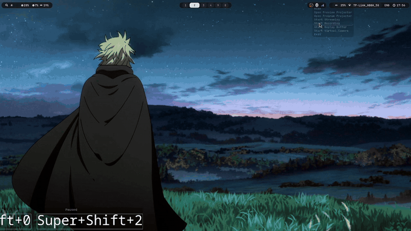
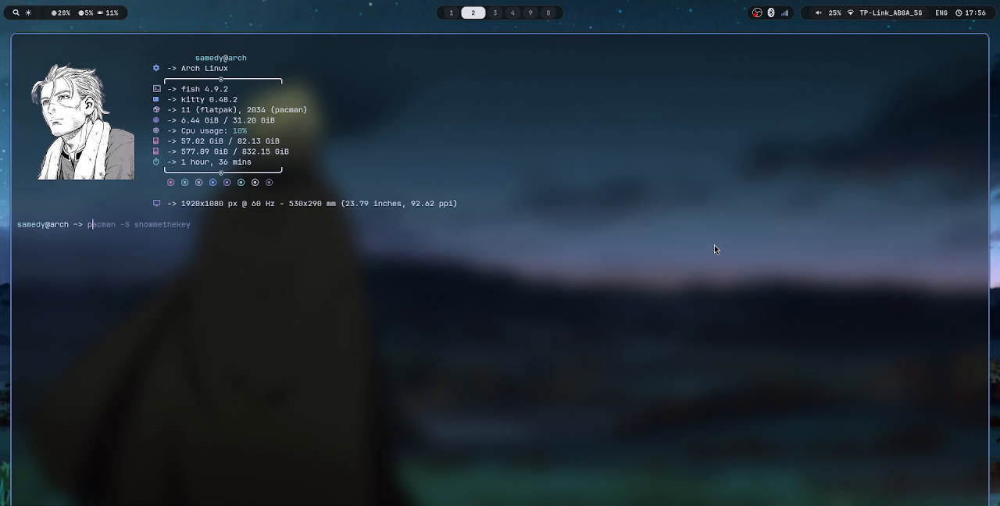
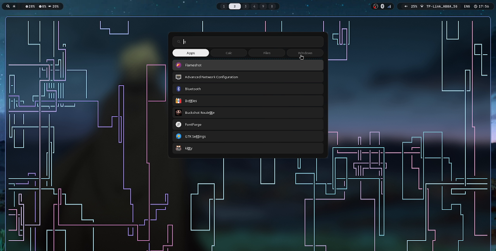
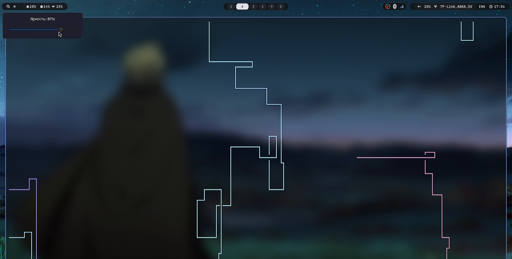

<div align="center">

# `samedy/dotfiles`

**Hyprland on Arch — configured in Lua, coloured by the wallpaper.**

<samp>
Hyprland · Waybar · Rofi · Kitty · Fish · Eww · Mako · Matugen
</samp>

<br>


<br>



<sub>Full quality: <a href="pics/Showcase.mp4"><code>pics/Showcase.mp4</code></a></sub>

</div>

---

## Look

<table>
<tr>
<td width="50%"></td>
<td width="50%"></td>
</tr>
<tr>
<td align="center"><sub>kitty + fish + fastfetch</sub></td>
<td align="center"><sub>rofi — Apps / Calc / Files / Windows</sub></td>
</tr>
<tr>
<td colspan="2"></td>
</tr>
<tr>
<td colspan="2" align="center"><sub>eww brightness popup — external monitor over DDC/CI</sub></td>
</tr>
</table>

---

## Stack

| | | |
|---|---|---|
| **Compositor** | [Hyprland](https://hypr.land) 0.55+ | Lua config, dwindle, 2-pass blur, custom bezier |
| **Wallpaper** | hyprpaper | |
| **Bar** | Waybar | grouped modules, mpris, DDC brightness button, XKB menu |
| **Launcher** | Rofi | `drun` + `calc` + `filebrowser` + `window`, tabbed |
| **Widgets** | Eww | brightness slider popup |
| **Terminal** | Kitty | `background_opacity 0.5`, JetBrains Mono NL |
| **Shell** | Fish | fastfetch on interactive start |
| **Notifications** | Mako | per-app rules |
| **Lock** | swaylock | |
| **Colours** | [Matugen](https://github.com/InioX/matugen) | Material You palette from the wallpaper |
| **Fetch** | fastfetch | boxed layout, Kitty graphics-protocol logo |

---

## Notable

**Colours follow the wallpaper.** Matugen renders `matugen/templates/waybar.css` → `waybar/theme.css`
and signals Waybar to reload live:

```toml
[templates.waybar]
input_path     = '~/.config/matugen/templates/waybar.css'
output_path    = '~/.config/waybar/theme.css'
reload_command = 'pkill -USR2 waybar'
```

`waybar/style.css` holds the structure plus fallback colours, then `@import "theme.css"` so the
generated palette wins. Change wallpaper → bar re-tints, no restart.

**DualSense as a launcher.** `controller-wofi.py` reads the raw evdev device, and only acts when
nothing is fullscreen so it never fires mid-game:

| Button | Action |
|---|---|
| Options | `wofi --show drun` |
| ○ | close it |
| PS | `steam -tenfoot` |

**Three keyboard layouts.** `us,ru,ua` on <kbd>Ctrl</kbd>+<kbd>Space</kbd>. The Waybar module shows
`ENG`/`RU`/`UA`; `waybar/scripts/lang.sh` reads the live list from `hyprctl` and anchors a Rofi picker
under the indicator.

---

## Keybinds

`mainMod` = <kbd>Super</kbd>

<table>
<tr><td valign="top">

**Apps**

| Keys | |
|---|---|
| <kbd>Super</kbd>+<kbd>Return</kbd> / <kbd>C</kbd> | kitty |
| <kbd>Super</kbd>+<kbd>Tab</kbd> | rofi |
| <kbd>Super</kbd>+<kbd>E</kbd> | dolphin |
| <kbd>Super</kbd>+<kbd>D</kbd> | zen-browser |
| <kbd>Super</kbd>+<kbd>T</kbd> | telegram |
| <kbd>Super</kbd>+<kbd>Y</kbd> | spotify |
| <kbd>Alt</kbd>+<kbd>3</kbd> / <kbd>5</kbd> | flameshot |

</td><td valign="top">

**Window & workspace**

| Keys | |
|---|---|
| <kbd>Super</kbd>+<kbd>Q</kbd> | close |
| <kbd>Super</kbd>+<kbd>F</kbd> | fullscreen |
| <kbd>Super</kbd>+<kbd>V</kbd> | float |
| <kbd>Super</kbd>+<kbd>P</kbd> | pseudo |
| <kbd>Super</kbd>+<kbd>←↑↓→</kbd> | focus |
| <kbd>Super</kbd>+<kbd>1…0</kbd> | workspace |
| <kbd>Super</kbd>+<kbd>Shift</kbd>+<kbd>1…0</kbd> | move to workspace |
| <kbd>Super</kbd>+<kbd>Shift</kbd>+<kbd>M</kbd> | exit Hyprland |

</td><td valign="top">

**Scratchpads & hardware**

| Keys | |
|---|---|
| <kbd>Super</kbd>+<kbd>S</kbd> | magic scratchpad |
| <kbd>Super</kbd>+<kbd>`</kbd> | spotify scratchpad |
| <kbd>Super</kbd>+<kbd>M</kbd> | send to spotify pad |
| <kbd>Super</kbd>+<kbd>O</kbd> | obsidian workspace (41) |
| <kbd>F7</kbd> / <kbd>F8</kbd> | monitor brightness (DDC) |
| <kbd>Ctrl</kbd>+<kbd>Space</kbd> | cycle kb layout |
| `XF86Audio*` | pamixer / playerctl |

</td></tr>
</table>

Mouse: <kbd>Super</kbd>+drag to move, +right-drag to resize, +scroll to change workspace.

---

## Layout

```
dotfiles/
├── hypr/
│   ├── hyprland.lua          # entry point
│   ├── conf/*.lua            # env, monitors, input, workspaces,
│   │                         # windowrules, keybinds, spotify, autostart
│   ├── hyprlang-backup/      # pre-Lua config, kept as a fallback
│   ├── hyprpaper.conf
│   └── check-config.sh
├── waybar/       config, style.css, theme.css (generated), scripts/
├── rofi/         config.rasi  (+ an old wofi theme under rofi/wofi/)
├── eww/          eww.yuck, eww.scss, scripts/  ← DDC brightness
├── matugen/      config.toml, templates/
├── kitty/        kitty.conf, themes/
├── fish/         config.fish, conf.d/
├── fastfetch/    config.jsonc + logo
├── mako/  swaylock/  wofi/
├── controller-wofi.py        # DualSense → launcher (lives in ~/.local/bin)
└── pics/                     # wallpapers + showcase recording
```

Note: the directory is `conf/`, **not** `conf.d/` — Lua's `require()` treats `.` as a path separator,
so `"conf.d/x"` would resolve to `conf/d/x`.

---

## Install

Directories mirror `~/.config`, so symlink what you want:

```bash
git clone https://github.com/ByteMe6/dotfiles ~/dotfiles
cd ~/dotfiles

for d in hypr waybar rofi eww matugen kitty fish fastfetch mako swaylock wofi; do
    ln -sfn "$PWD/$d" ~/.config/"$d"
done

install -Dm755 controller-wofi.py ~/.local/bin/controller-wofi.py
```

Packages: **[DEPENDENCIES.md](DEPENDENCIES.md)**.

`hypr/check-config.sh` runs `hyprctl reload` (it still audits the old `conf.d/*.conf` tree).

---

## Notes to self

- `.gitignore` is an allowlist. New top-level dirs need an explicit `!dir/` line.
- `hypr/conf/autostart.lua` and `hypr/hyprpaper.conf` hold absolute `/home/samedy/…` paths.
- `swaylock/config` points at `/home/byteme/pics/yellow.jpg` — stale user, stale wallpaper.
- `hypr/conf/spotify.lua` binds <kbd>Super</kbd>+<kbd>J</kbd> to `UserScripts/smart-close.sh`, which
  doesn't exist — no-op.
- `waybar/config` says `"position": "down"`, not a valid Waybar value; that's why the bar renders on top.
- `fish/config.fish` points the Kitty logo at `~/pics/torfinFaceFastfetch.png`, outside this repo.

---

<div align="center">
<sub>Wallpaper: Thorfinn, <i>Vinland Saga</i> — <code>pics/torfinBack.png</code>.</sub>
</div>
